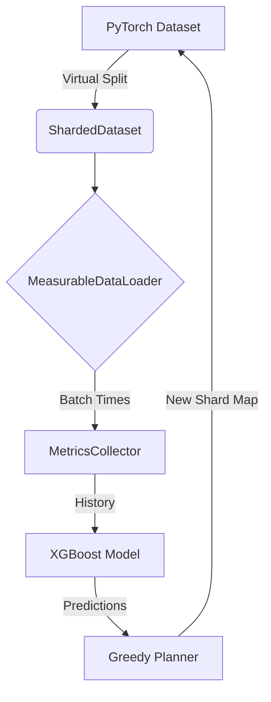

# ⚡ ShardSense
### Adaptive Data Sharding with Online Load Imbalance Prediction

[](https://www.python.org/)
[](https://pytorch.org/)
[](LICENSE)
[]()

> **Stop waiting for stragglers.** ShardSense optimizes distributed training throughput by dynamically moving data shards from slow workers to fast workers in real-time.

---

## 🚀 Interactive Quick Start

**What do you want to do?**

<details>
<summary><b>👀 See it in action (30 seconds)</b></summary>
<br>

Run the **Parallel Production Demo**. This simulates 8 concurrent workers where 2 are artificially lagging. Watch ShardSense detect and fix them!

```bash
# 1. Install Dependencies
pip install -r requirements.txt
pip install streamlit

# 2. Run the Simulation (Background)
python demo_parallel.py

# 3. Launch Dashboard (New Terminal)
streamlit run dashboard.py
```
</details>

<details>
<summary><b>🛠️ Integrate it into my PyTorch training loop</b></summary>
<br>

It's a drop-in replacement for your current approach.

```python
from shardsense.runtime.engine import ShardSenseRuntime

# 1. Wrap your existing Huge Dataset
dataset = MyImageNetDataset(root="/data")

# 2. Initialize ShardSense (It virtualizes the dataset)
runtime = ShardSenseRuntime(dataset, num_shards=1024, num_workers=16)

# 3. Get the loader for THIS worker
dataloader = runtime.get_dataloader(worker_id=rank)

# 4. Train as usual!
for batch in dataloader:
    train_step(batch)

# 5. End of Epoch -> Magic happens here (Resharding)
runtime.epoch_end(epoch)
```
</details>

---

## 📊 Features & Architecture

| Feature | Description |
| :--- | :--- |
| **🧠 Adaptive Intelligence** | Uses **XGBoost** to learn the speed profile of every worker. |
| **⚖️ Smart Rebalancing** | `GreedyResharder` moves data only when the predicted speedup > network cost. |
| **💾 Zero-Copy Sharding** | Uses "Virtual Indices". We verify your 10TB dataset stays where it is; we just change *who* reads *what*. |
| **📈 Live Observability** | Includes a full **Streamlit** dashboard to visualize stragglers. |

### System Diagram


---

## 📂 Project Structure

- `shardsense/`: The core library.
    - `runtime/`: Orchestrator.
    - `data/`: Virtual dataset wrappers.
    - `planner/`: Optimization logic.
- `demo_parallel.py`: **Main Demo Script**.
- `dashboard.py`: **Visualization App**.
- `shardsense.db`: SQLite metrics store (auto-created).

---

## 🤝 Contributing

We welcome PRs for:
- Supporting `torch.distributed` natively.
- Adding Network Bandwidth estimation to the cost function.
- Kubernetes operator integrations.

---
*Built with ❤️ by [Tokunbo Ajayi](https://github.com/tokunboajayi)*
